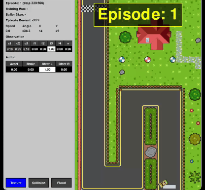

# RL Car Race

This project is about training a RL Deep Q-Network (DQN) agent to navigate a racing car on a custom track. The environment is built using Pygame, and the agent uses a [Rainbow DQN](https://arxiv.org/abs/1710.02298) architecture for learning.



## Setup

### Create and activate conda environment

```bash
conda create -n rl_car_race python=3.13
conda activate rl_car_race
```

### Install dependencies

```bash
pip install -r requirements.txt
```
## Launching Demo

To run a demo of the pre-trained models, like in the gif execute:

```bash
python main.py --mode demo --render-mode human
```
## Training the Rainbow DQN Agent

It's possible also to run the training with the UI monitor enabled, which shows the latest checkpoint while training runs in the background:

```bash
python main.py --mode train-human --episodes 500 --max-steps 700
```

Otherwise for slitly better performance you can run it in a headless mode:

```bash
python main.py --mode train --episodes 500 --max-steps 700
```

Checkpoints are written to `models/dqn_last_ep_<episode>.pt` and `models/dqn_best_ep_<episode>.pt`, where `<episode>` is a zero-padded global episode number.


## Running a Trained Agent

Launch the environment with the best checkpoint:

```bash
python main.py --mode play --agent-type DQN --render-mode human
```

Or if you prefer a specific model:
```bash
python main.py --mode play --agent-type DQN --render-mode human --model-path models/dqn_best_ep_000360.pt
```

It's also possible to test if the train model generalize enough to work also on an different map:

```bash
python main.py --mode play --agent-type DQN --render-mode human --model-path models/demo/dqn_best_ep_001776.pt --map assets/maps/track_extended.tmx
```

## Note
- I didn't test it on CUDA, but as RL needs frequent interactions with the environment, the bottleneck is likely to be the environment simulation rather than the small neural network.
- In the gif it's present a texture which will not be present when you clone this repo. The texture used is: [Flat Race](https://opengameart.org/content/checkerboard-texture). Credit to its author: [Alb Pixel](https://alb-pixel-store.itch.io/)
- The map and the tileset was created with [Tiled](https://www.mapeditor.org/)